# Architecture Diagrams
## Developer Experience Platform (DXP)

### System Architecture Overview

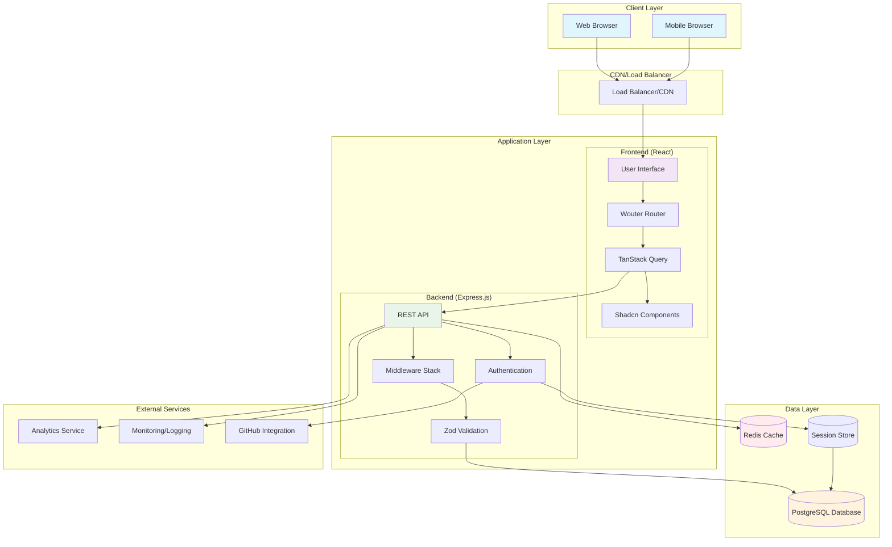

### Component Architecture

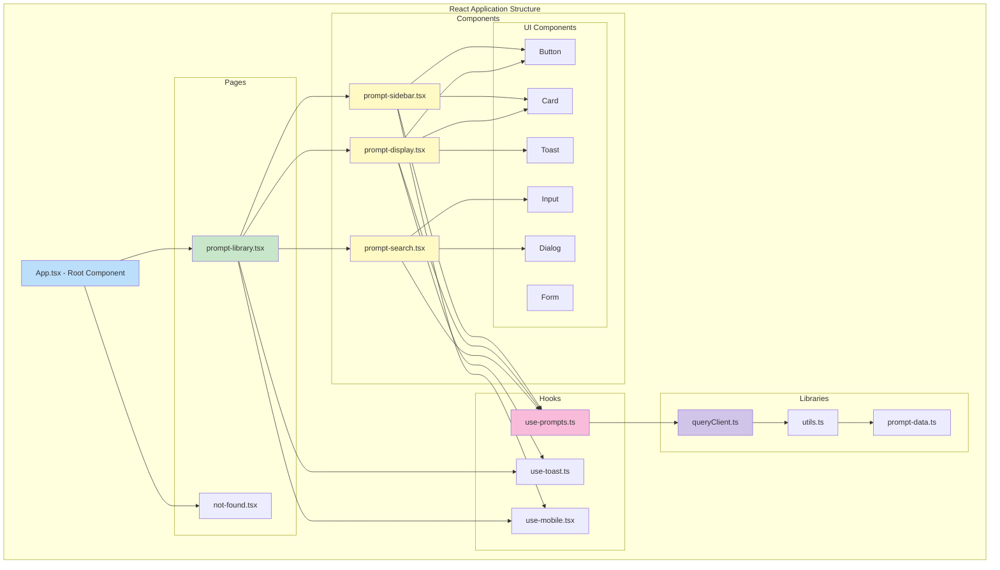

### Data Flow Architecture

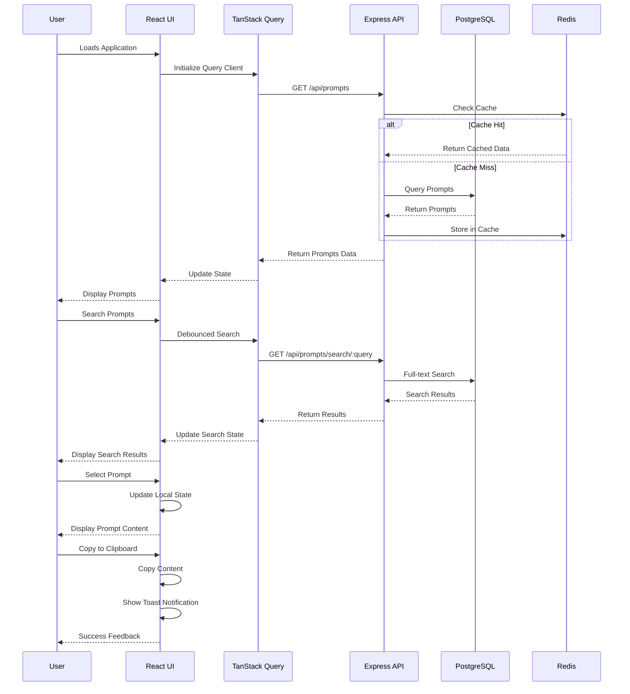

### Database Schema Diagram

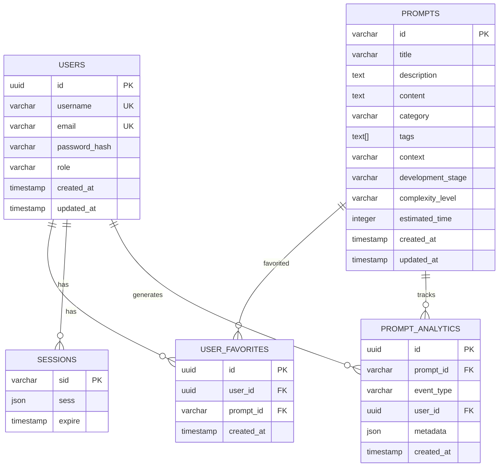

### Authentication Flow

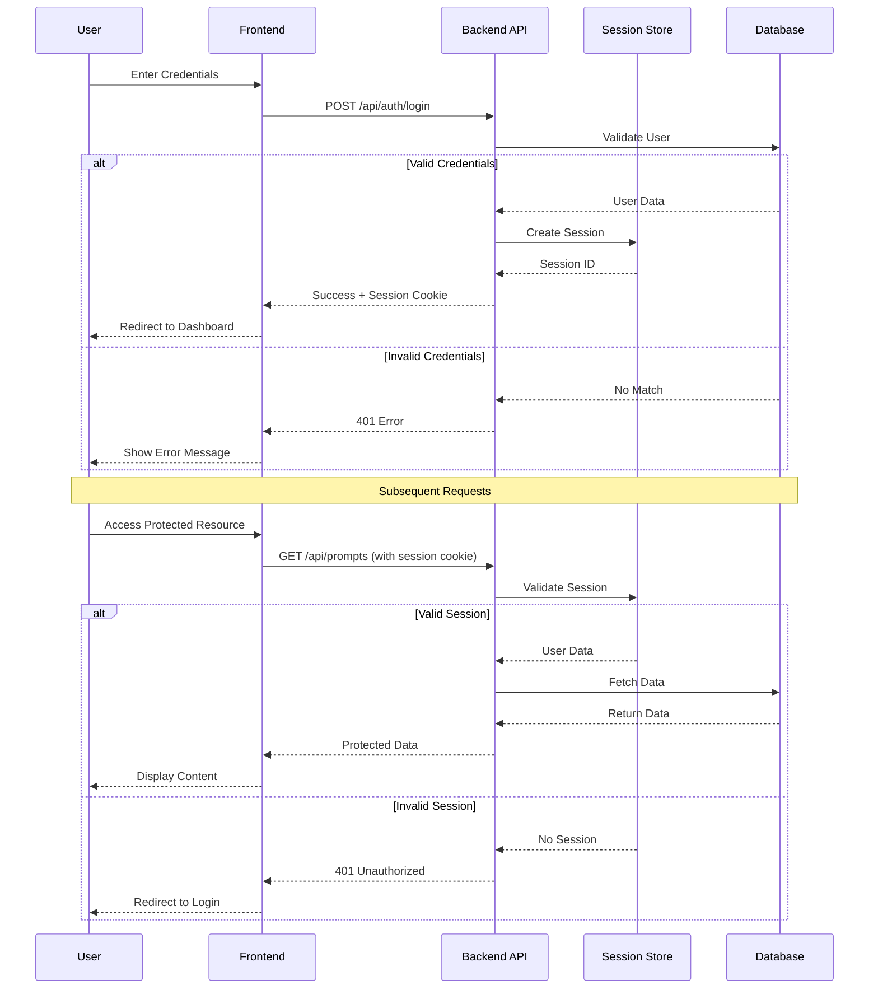

### Deployment Architecture

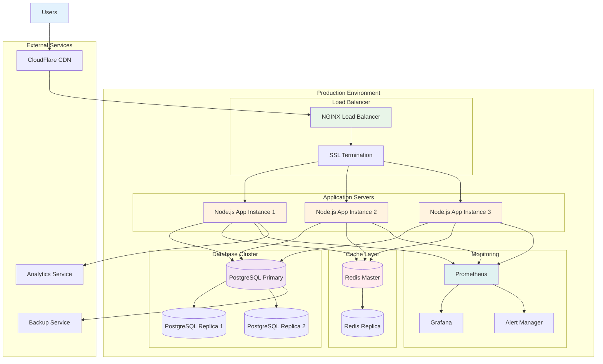

### API Request Flow

```mermaid
graph LR
    Client[Client Request] --> CORS[CORS Check]
    CORS --> RateLimit[Rate Limiting]
    RateLimit --> Auth[Authentication]
    Auth --> Validation[Request Validation]
    Validation --> Controller[Controller Logic]
    Controller --> Service[Service Layer]
    Service --> Database[(Database)]
    Database --> Cache[Cache Update]
    Cache --> Response[Format Response]
    Response --> Client
    
    subgraph "Middleware Stack"
        CORS
        RateLimit
        Auth
        Validation
    end
    
    subgraph "Application Logic"
        Controller
        Service
    end
    
    subgraph "Data Layer"
        Database
        Cache
    end
    
    style Client fill:#e1f5fe
    style Controller fill:#e8f5e8
    style Database fill:#fff3e0
    style Cache fill:#ffebee
```

### Search Architecture

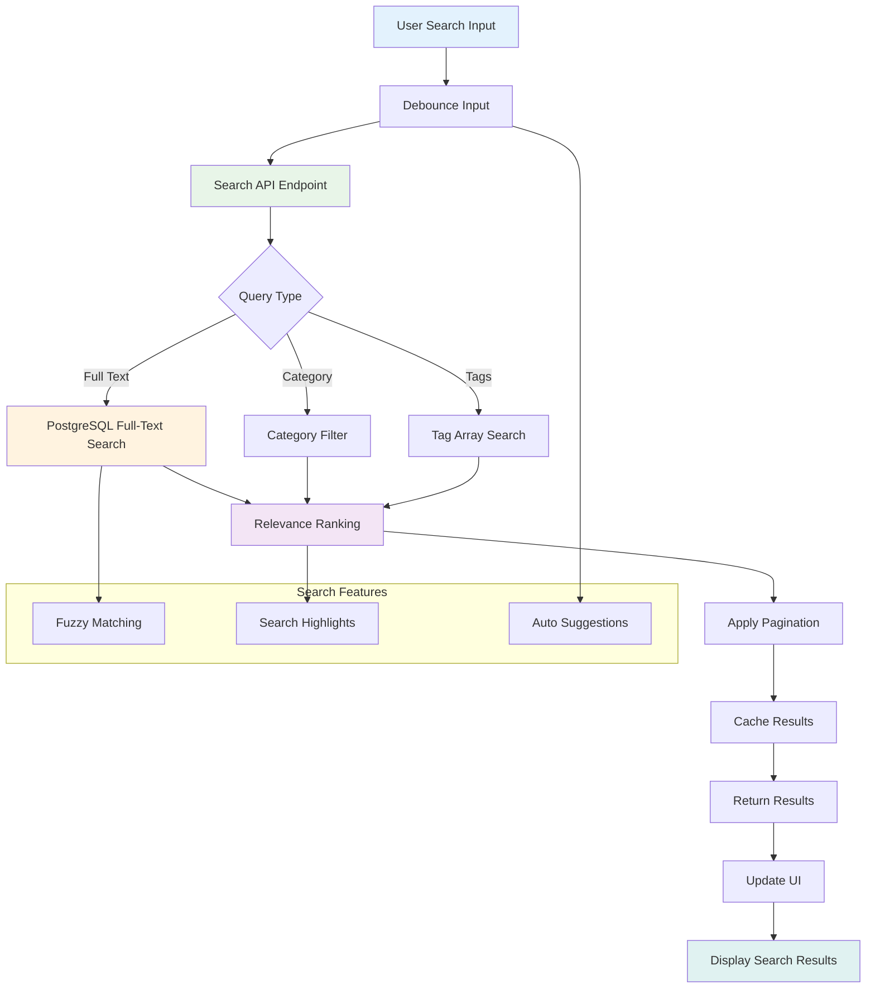

### Caching Strategy

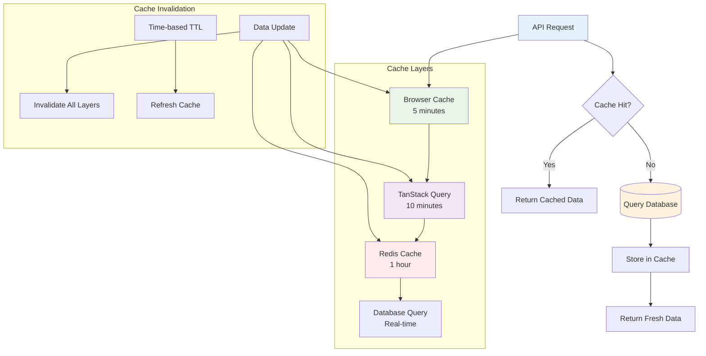

### Error Handling Flow

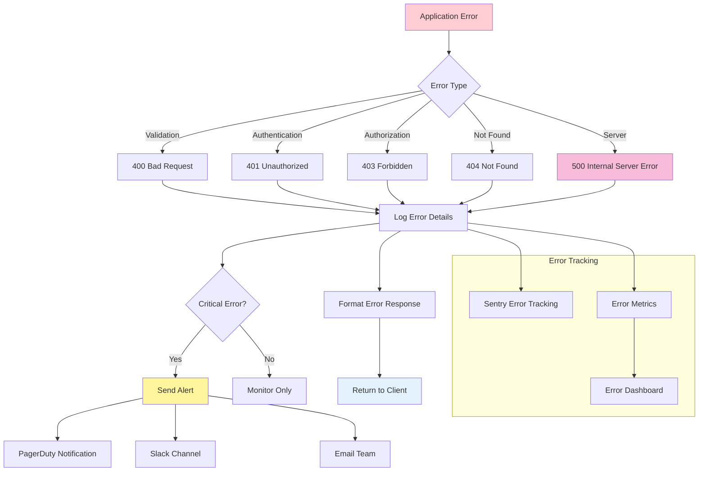

### Performance Monitoring

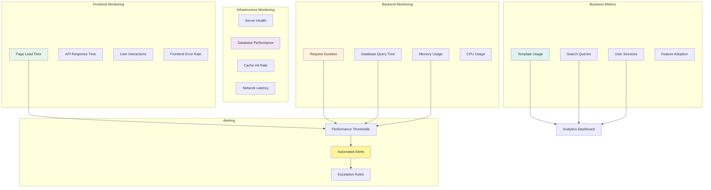

This architecture documentation provides comprehensive visual representations of the Developer Experience Platform's system design, data flow, and operational characteristics. These diagrams serve as reference materials for development, deployment, and maintenance activities.